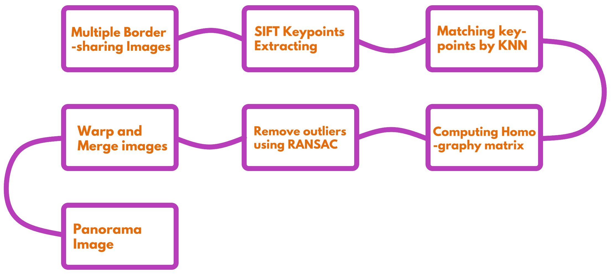
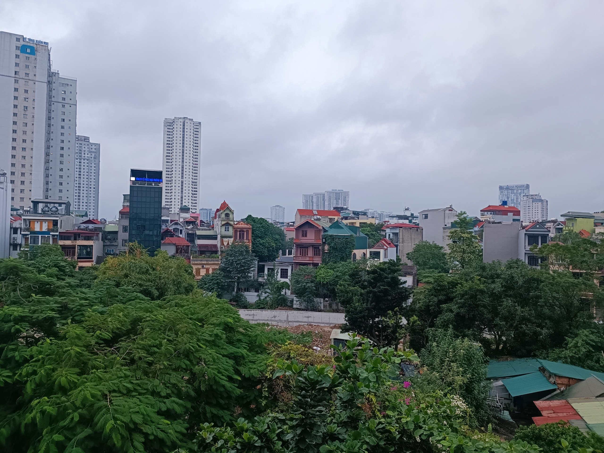
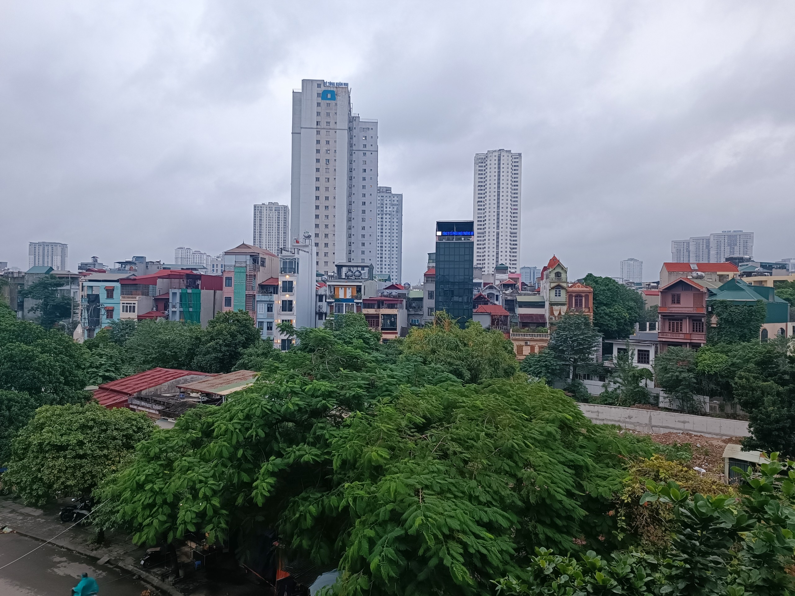
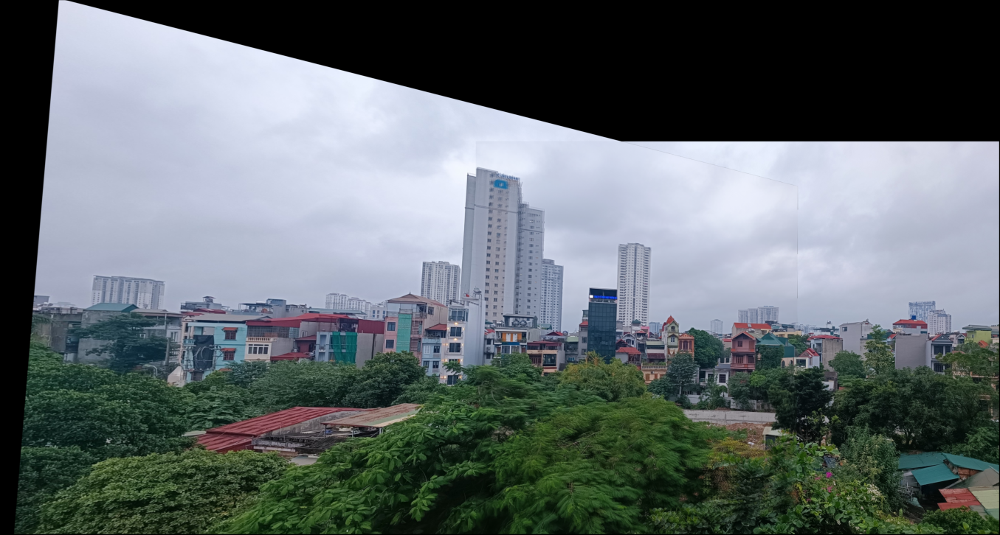

# Panorama Stitching Image using SIFT, KNN, and RANSAC
## How a Panorama Image is created?

From two image paths (left & right) create a panorama from them.
* Assign two string as images path
* Read image from image path
* Detect Keypoint and Descriptors by SIFT
* Finding potential matches by KNN
* Computing Homography matrix, and remove outliers by RANSAC
* Warping and Merging and Plotting a complete panorama image
* Plot out panorama image 

## Brief Description
### Two input images
                |  
:-------------------------:|:-------------------------:
            |  

### Result

## How to use this project
* Clone this repo `https://github.com/khangnt21/PanoramaStitching.git`
* Make sure Python is installed
* Run `pip install -r requirements.txt` to install necessary dependencies
* Two images required for panorama stitching could be replaced in `img `folder
* Run `python pano-stitch.py` to make the panorama

## Members 
* Nguyễn Thế Khang - 21020692
* Trần Ngọc Bách - 21020170
* Lê Trung Kiên - 21021602
* Ngô Quang Tăng - 22029037

## Reference
[Distinctive Image Features
from Scale-Invariant Keypoints](https://www.cs.ubc.ca/~lowe/papers/ijcv04.pdf)
